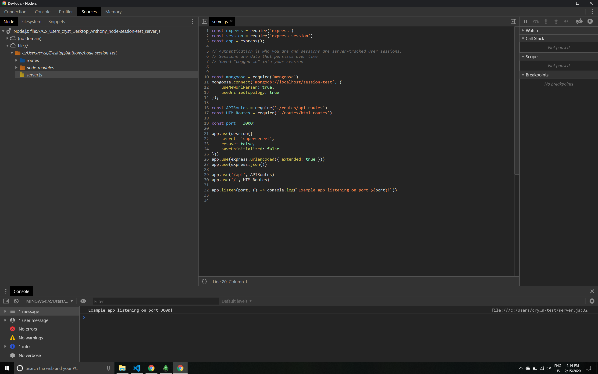

# Sessions

Sessions temporarily stores information related to the activities of the user while connected. 

Server validates/authenticates user, sends a cookie back to the user. 

The user gets the cookie and whenever they send a request to the server, the local machine sends the request along with the cookie. 

The server identifies the user session by that cookie. 

The cookie is tied to the website. The cookie and session id will be the same. The session and cookie will **stay the same** until you log out. 

A session cookie is used in web pages for storing information in case the user leaves the web page or closes down their Internet browser. For example, this is one way a website can remember what is in your shopping cart if you leave and come back.

Websites requiring a username and password use session variables to help transfer data between web pages, but only while the user is logged into the computer.

Sessions are stored in the database/server-side. 
    * When users log out, we destroy the current session, create a **new** session with a new ID, just without a user loggedIn, so the site will now ask the user to log in again. 

When debugging, input in terminal
node --inspect server.js

When running, input in terminal
nodemon server.js

If you click on the "i" in the url address
    * There is a dropdown for Cookies-- dropdown to your cookies
    * connect.sid with your session id
        * connect.sid is whatever the server wants to name cookies

Prevent session hijacking-- that's why sessions are deleted/recreated so often.